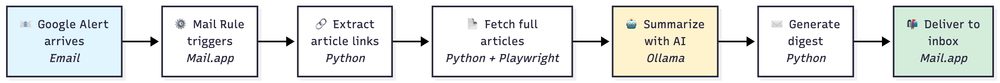

# AppletScriptorium — Summarizer Module

AppletScriptorium is a collection of macOS automation agents orchestrated through AppleScript, shell, and Python helpers. The first agent, **Summarizer**, watches Mail.app for Google Alerts, extracts article links, fetches pages, summarizes them with a local LLM, and generates intelligent digest emails.

## How It Works

Subscribe to Google Alerts on any topics you care about (tech trends, competitor news, research papers, etc.). When an alert arrives in your inbox, the Summarizer automatically processes it:



**The automated workflow:**

1. **Captures** the alert email from Mail.app
2. **Extracts** all article links from the email
3. **Fetches** each article's full content
4. **Summarizes** every article using a local AI model (runs privately on your Mac)
5. **Generates** an intelligent digest email with:
   - Executive summary across all articles
   - 4-bullet summaries per article (key findings, actionable insights, market signals, concerns)
   - Cross-article themes and patterns
6. **Delivers** the digest to your inbox

All processing happens locally on your Mac—no data sent to external services. The entire workflow runs automatically when alerts arrive (or on a schedule you control).

**Customize:** Edit `Summarizer/config.py` to adjust the AI model, summary format, timeouts, or any other behavior.

## Quick Start

**New to AppletScriptorium?** See the complete setup guide: **[SETUP.md](./docs/SETUP.md)**

```bash
cd ~/Code
git clone https://github.com/yourusername/AppletScriptorium.git
cd AppletScriptorium
./install.sh           # Automated setup (prereqs, dependencies, model)
./setup-mail-rule.sh   # Configure Mail rule automation (interactive)
./validate.sh          # Verify installation
```

**Troubleshooting?** See **[TROUBLESHOOTING.md](./docs/TROUBLESHOOTING.md)**

---

## Repository Structure

```
.
├── .env.template                 # Environment variable template (copy to .env)
├── AGENTS.md                     # AI assistant guidelines (Codex, Gemini, etc.)
├── CLAUDE.md                     # Claude Code development guide
├── docs/                         # Documentation
│   ├── SETUP.md                  # Installation guide
│   ├── TROUBLESHOOTING.md        # Common issues and solutions
│   ├── workflow-diagram.png      # Visual workflow diagram
│   └── workflow-diagram.mmd      # Mermaid source for diagram
├── Summarizer/                   # Google Alert Intelligence agent
│   ├── config.py                 # Configuration constants
│   ├── cli.py                    # Main orchestrator
│   ├── link_extractor.py         # Extract links from alert emails
│   ├── article_fetcher.py        # HTTP fetcher with Markdown fallbacks (url-to-md / Jina)
│   ├── urltomd_fetcher.py        # url-to-md CLI wrapper for Markdown fallbacks
│   ├── jina_fetcher.py           # Jina Reader API fallback
│   ├── markdown_cleanup.py       # Markdown content cleaning and validation
│   ├── content_cleaner.py        # HTML to Markdown conversion
│   ├── summarizer.py             # LLM summarization
│   ├── digest_renderer.py        # HTML/text digest generation
│   ├── fetch-alert-source.applescript  # Manual alert capture
│   ├── templates/process-alert.scpt    # Mail rule automation
│   ├── requirements.txt          # Python dependencies
│   ├── Samples/                  # Fixtures for regression tests
│   └── tests/                    # Pytest suite
└── README.md                     # This file
```

Future agents will live alongside `Summarizer/`. Shared utilities will migrate to `shared/` when needed.

---

## Usage

### Mail Rule Automation (Recommended)

Event-driven processing triggered when Google Alerts arrive:

1. Run `./setup-mail-rule.sh` to install AppleScript
2. Create Mail rule:
   - **From**: `googlealerts-noreply@google.com`
   - **Subject**: `Google Alert -`
   - **Action**: Run AppleScript → `process-alert.scpt`
3. Grant Accessibility permissions (System Settings → Privacy & Security → Accessibility → Mail.app)

**Workflow:**
Alert arrives → Mail rule triggers → Pipeline runs → Digest email sent automatically

See **[SETUP.md](./docs/SETUP.md)** for detailed configuration.

### CLI

Run the full pipeline (fetch, summarize, generate digest):

```bash
# Process most recent Google Alert
python3 -m Summarizer.cli run \
  --output-dir runs/manual-$(date +%Y%m%d-%H%M%S) \
  --subject-filter "Google Alert -"

# Limit articles and send digest via email
python3 -m Summarizer.cli run \
  --output-dir runs/test \
  --max-articles 5 \
  --email-digest user@example.com \
  --email-sender user@example.com
```

**Configuration**: Defaults in `Summarizer/config.py`. Override via CLI flags or `ALERT_*` environment variables.

**Outputs**: `alert.eml`, `alert.tsv`, `articles/`, `digest.html`, `digest.txt`, `workflow.log`

**CLI Flags:**
- `--model MODEL` — Override Ollama model (default: qwen3:latest)
- `--max-articles N` — Limit articles processed
- `--email-digest ADDRESS` — Send digest via Mail.app (repeatable)
- `--email-sender ADDRESS` — Select Mail.app sender account
- `--subject-filter PATTERN` — Match specific inbox messages

### Cron Scheduling

For fixed-schedule digests instead of event-driven processing:

1. Create `~/.alert-env` with configuration
2. Add cron job: `crontab -e`
   ```cron
   0 7 * * 1-5 /bin/bash -lc 'source ~/.alert-env; /path/to/Summarizer/bin/run_alert.sh'
   ```

See **[SETUP.md](./docs/SETUP.md)** for cron configuration details.

### Workflow Script (run_workflow.sh)

Alternative workflow script for sequential processing:

```bash
./run_workflow.sh
```

**What it does:**
- Captures latest Google Alert from Mail.app inbox
- Extracts article links sequentially (no parallelism)
- Fetches articles, cleans content, generates summaries
- Uses PYTHONPATH and inline Python scripts

**Outputs**: Creates timestamped run directory with `alert.eml`, `alert.tsv`, `articles/*.html`, `summaries/*.json`

**When to use**: Useful for debugging individual pipeline stages or when parallel processing isn't needed.

---

## Testing

```bash
# Run all tests
python3 -m pytest Summarizer/tests

# Run specific test
python3 -m pytest Summarizer/tests/test_link_extractor.py -v
```

---

## Development

- **For Claude Code**: See **[CLAUDE.md](./CLAUDE.md)** for development commands, code style, and module patterns
- **For other AI assistants**: See **[AGENTS.md](./AGENTS.md)** for build commands and project conventions
- **Configuration**: Edit `Summarizer/config.py` for model, timeouts, parallelism, domain lists

**Key technical details:**
- System Python required (no venv support for Mail rules)
- Module invocation: `python3 -m Summarizer.cli` (NOT `python3 Summarizer/cli.py`)
- Parallel processing: ThreadPoolExecutor with max 5 workers (~70% faster)
- Fixture management: `Summarizer/refresh-fixtures.py`
- **Ollama auto-recovery**: Pipeline detects unresponsive Ollama (120s timeout), auto-kills/restarts it, and retries—see [TROUBLESHOOTING.md](./docs/TROUBLESHOOTING.md#ollama-unresponsive-timeout) for details
- Optional: `url-to-md` CLI for Cloudflare-protected sites (`npm install -g url-to-markdown-cli-tool`)
- Optional: `JINA_API_KEY` env var for Jina Reader API fallback

---

## Support

- **Setup issues**: [SETUP.md](./docs/SETUP.md)
- **Troubleshooting**: [TROUBLESHOOTING.md](./docs/TROUBLESHOOTING.md)
- **Development**: [CLAUDE.md](./CLAUDE.md) or [AGENTS.md](./AGENTS.md)
- **Logs**: `runs/*/workflow.log`
